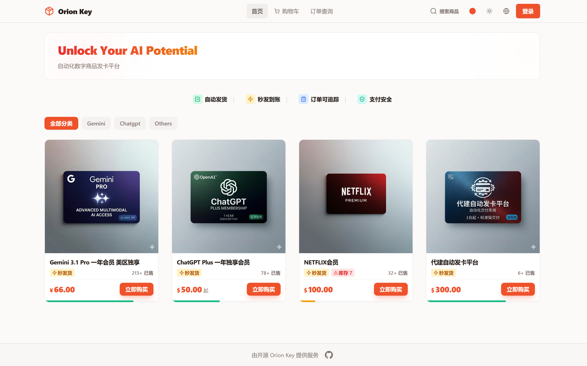
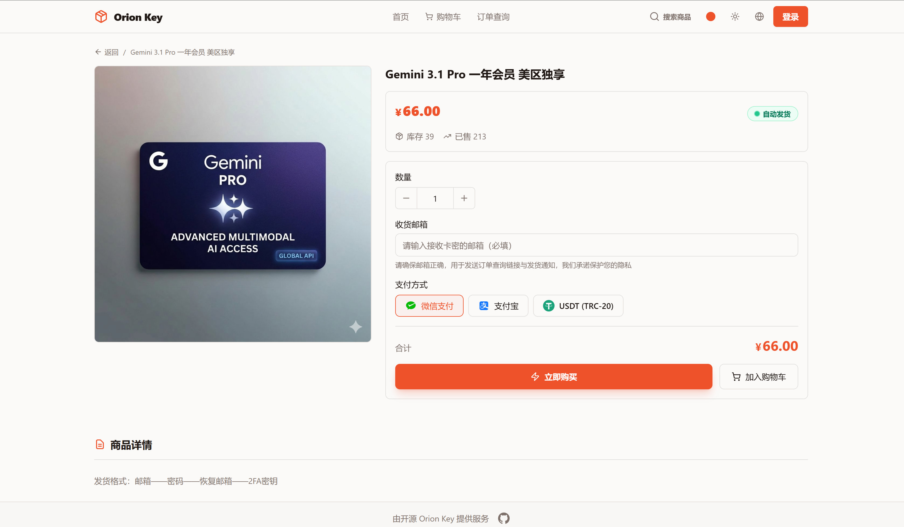
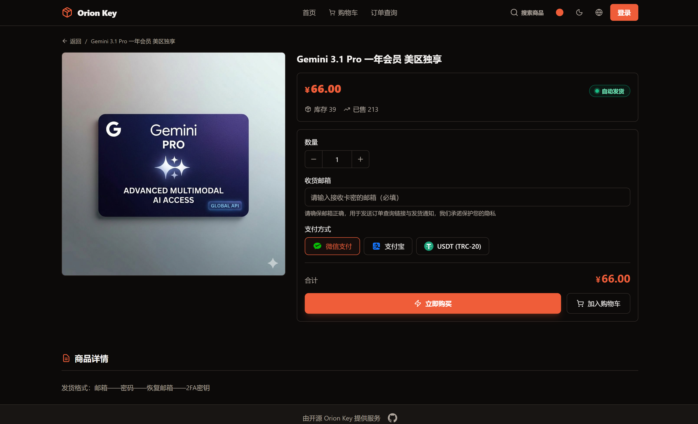
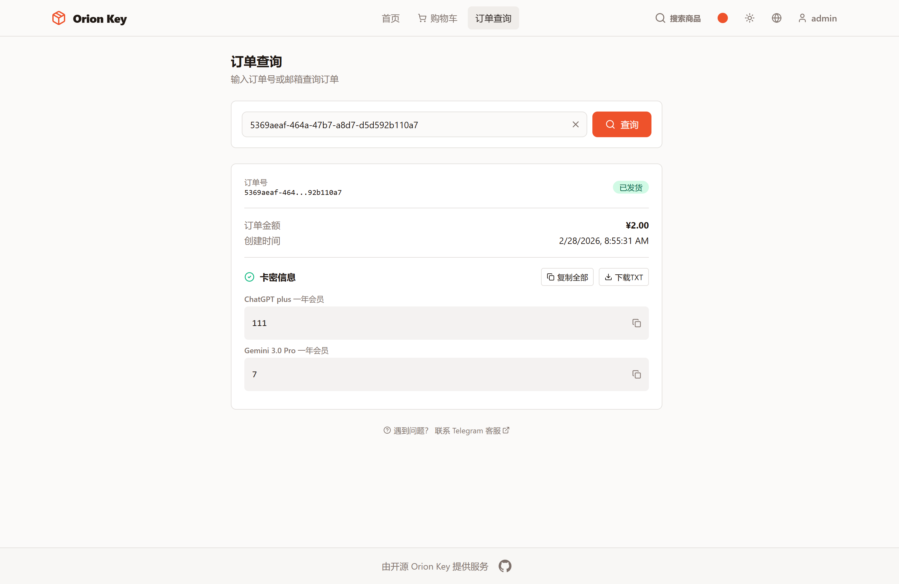
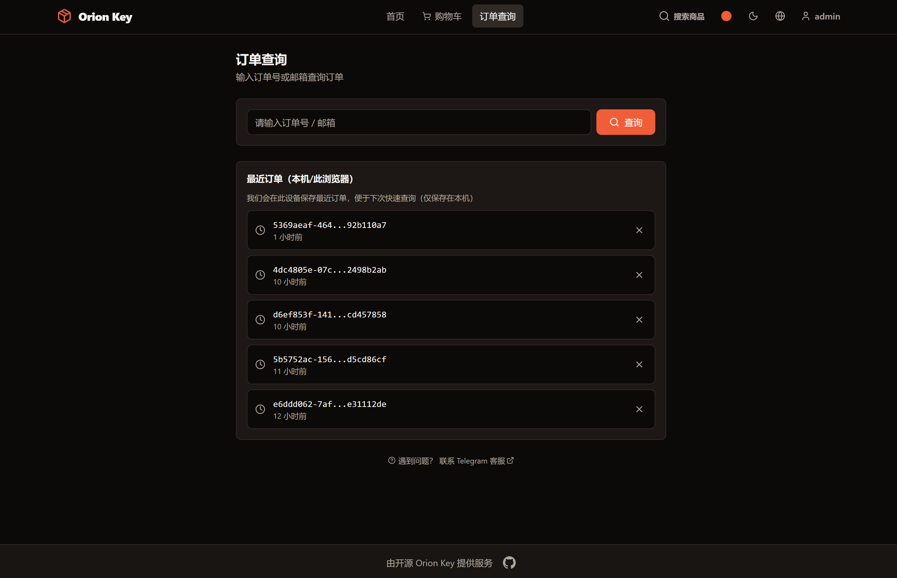
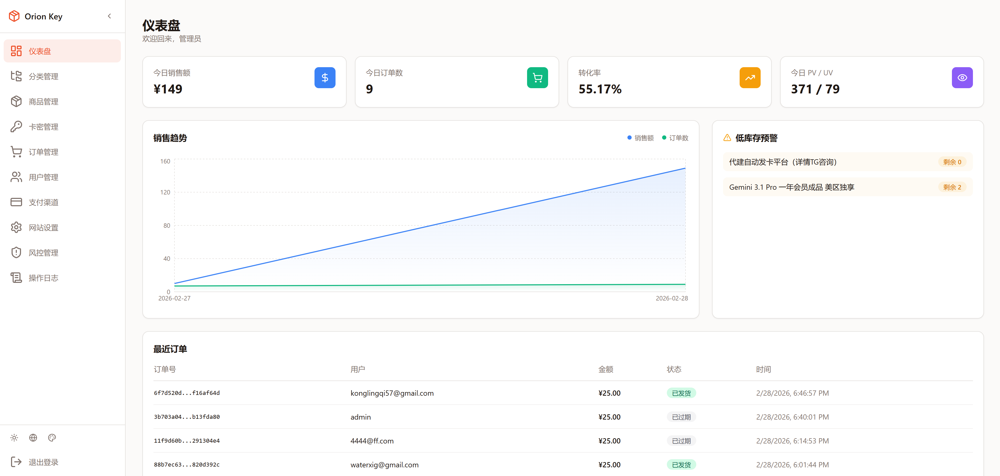
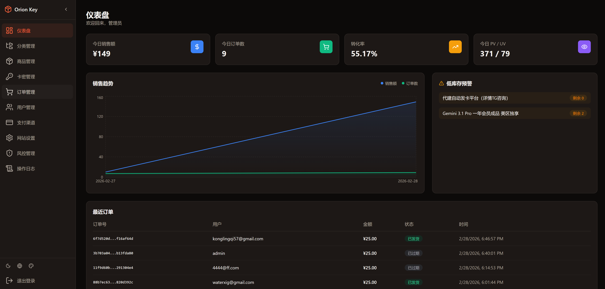

<div align="center">

# Orion Key

**自动化数字商品（卡密）发卡平台**

Automated Digital Goods Delivery Platform

[](LICENSE)


简体中文 | [English](README.en.md)

</div>

---

## 截图预览

<details open>
<summary><b>前台页面</b></summary>
<br>

| 首页（亮色） | 首页（暗色） |
|:---:|:---:|
|  |  |

| 商品详情（亮色） | 商品详情（暗色） |
|:---:|:---:|
|  |  |

| 订单查询（亮色） | 订单查询（暗色） |
|:---:|:---:|
|  |  |

</details>

<details open>
<summary><b>管理后台</b></summary>
<br>

| Dashboard（亮色） | Dashboard（暗色） |
|:---:|:---:|
|  |  |

</details>

---

## 核心特性

|  |  |
|---|---|
| 🛒 **自动发卡** — 下单支付后自动发放卡密，零人工干预 | 🎨 **主题切换** — 支持亮色/暗色模式，多主题色自由切换 |
| 📦 **商品管理** — 分类、上下架、库存、批量导入卡密 | 🔒 **安全认证** — JWT 无状态认证 + BCrypt 加密 |
| 💳 **多支付渠道** — 可扩展的支付架构，支持微信/支付宝 | 🛡️ **风控系统** — IP 限流、登录防爆破、订单防刷 |
| 📊 **管理后台** — 仪表盘数据概览、订单/用户/站点全面管理 | 🔍 **订单追踪** — 订单号查询卡密，支持游客和会员 |
| 🛍️ **购物车** — 多商品合并下单，提升购买体验 | ⚙️ **站点配置** — 公告、弹窗、维护模式，后台一键开关 |

---

## 支付渠道集成

| 渠道            | 接入方式 | 说明 |
|---------------|---------|------|
| 支付宝           | 易支付（聚合） | 通过第三方易支付平台接入 |
| 微信支付          | 易支付（聚合） | 通过第三方易支付平台接入 |
| 支付宝 (待实现)     | 原生对接 | 需企业资质（支付宝开放平台） |
| 微信支付 (待实现)    | 原生对接 | 需企业资质（微信支付商户号） |
| USDT (TRC-20) | BEpusdt 自托管 | 链上自动确认，无第三方托管 |
| USDT (BEP-20) | BEpusdt 自托管 | 链上自动确认，无第三方托管 |

> 支付架构可扩展，可通过后台「支付渠道管理」自由配置和切换。

---

## 技术架构

| 层级 | 技术栈 |
|------|--------|
| **前端** | Next.js 16 · React 19 · TypeScript · Tailwind CSS 3 · shadcn/ui |
| **后端** | Spring Boot 3.4 · Java 22 · Spring Data JPA · Spring Security |
| **数据库** | PostgreSQL 14+ |
| **认证** | JWT (jjwt) · BCrypt |
| **构建** | pnpm (前端) · Maven (后端) |

### Monorepo 目录结构

> 基于 pnpm workspaces 的 Monorepo 架构，前后端统一管理。

```
orion-key/
├── apps/
│   ├── web/                          # Next.js 前端
│   │   ├── app/
│   │   │   ├── (store)/              # 前台路由组（首页、商品、购物车、订单、支付…）
│   │   │   └── admin/                # 管理后台路由组（仪表盘、商品/卡密/订单/用户管理…）
│   │   ├── features/                 # 业务功能模块
│   │   ├── services/                 # API 调用层（统一封装后端接口）
│   │   ├── hooks/                    # 自定义 React Hooks
│   │   ├── components/               # 通用 UI 组件（shadcn/ui）
│   │   ├── types/                    # TypeScript 类型定义
│   │   └── next.config.mjs           # Next.js 配置（含 API 代理 rewrites）
│   │
│   └── api/                          # Spring Boot 后端
│       └── src/main/
│           ├── java/com/orionkey/
│           │   ├── controller/       # REST 控制器（前台 + Admin）
│           │   ├── entity/           # JPA 实体（16 张表）
│           │   ├── repository/       # 数据访问层
│           │   ├── service/          # 业务逻辑层
│           │   ├── config/           # 安全、JWT、跨域等配置
│           │   └── model/            # DTO / VO
│           └── resources/
│               ├── application.yml   # 应用配置（数据库、JWT、邮件、上传等）
│               └── data.sql          # 初始化数据（管理员、站点配置、支付渠道）
│
├── docker-compose.prod.yml           # 生产 Docker Compose 编排
├── .env.example                      # 环境变量模板
└── pnpm-workspace.yaml               # Monorepo 工作区声明
```

---

## 先决条件

开始之前，请确保已安装以下工具：

| 工具 | 版本 | 说明 |
|------|------|------|
| Java | 22+ | 后端运行环境 |
| Maven | 3.9+ | 后端构建工具 |
| Node.js | 20+ | 前端运行环境 |
| pnpm | 9+ | 前端包管理（`npm i -g pnpm`） |
| PostgreSQL | 14+ | 数据库，需提前创建库和用户 |

---

## 配置

核心配置文件：`apps/api/src/main/resources/application.yml`

所有配置项均支持**环境变量覆盖**（格式 `${ENV_VAR:默认值}`），本地开发可直接修改 yml，生产环境建议通过环境变量注入。

### 数据库

```yaml
spring:
  datasource:
    url: ${DB_URL:jdbc:postgresql://localhost:5432/orion_key}
    username: ${DB_USERNAME:orionkey}
    password: ${DB_PASSWORD:your_password}
```

首次启动自动建表（`ddl-auto: update`），启动后执行一次初始化 SQL(data.sql文件) 写入管理员账户、站点配置：


> SQL 内置 `WHERE NOT EXISTS`，多次执行不会产生重复数据。

### JWT 认证

```yaml
jwt:
  secret: ${JWT_SECRET:orion-key-dev-secret-key-must-be-at-least-256-bits-long-for-hs256}
  expiration: 86400000  # 24 小时
```

生产环境**必须**替换为随机密钥：

```bash
openssl rand -base64 64
```

### 密码加密模式

```yaml
security:
  password-plain: ${PASSWORD_PLAIN:true}  # true=明文密码(开发用), false=BCrypt(生产用)
```

- **本地开发**：`true`（默认），密码明文存储，方便调试
- **生产环境**：设为 `false`，启用 BCrypt 加密，**必须在切换前重置所有用户密码**

### 邮件发送

```yaml
spring:
  mail:
    host: ${MAIL_HOST:smtp.example.com}
    port: ${MAIL_PORT:465}
    username: ${MAIL_USERNAME:your@email.com}
    password: ${MAIL_PASSWORD:your_password}

mail:
  enabled: ${MAIL_ENABLED:true}       # 邮件功能总开关，设为 false 可关闭所有邮件发送
  site-url: ${MAIL_SITE_URL:https://your-domain.com}
```

### 文件上传

```yaml
upload:
  path: ${UPLOAD_PATH:./uploads}                # 文件存储路径
  url-prefix: ${UPLOAD_URL_PREFIX:/api/uploads}  # 访问 URL 前缀
```

---

## 本地开发启动

### 方式一：分别启动

**启动后端：**

```bash
cd apps/api
mvn spring-boot:run
# 启动于 http://localhost:8083/api
```

**启动前端：**

```bash
cd apps/web
pnpm install
pnpm dev
# 启动于 http://localhost:3000
```

### 方式二：Monorepo 根目录启动前端

```bash
# 在项目根目录
pnpm install
pnpm dev:web
# 等价于 pnpm --filter @orion-key/web dev
```

> **API 代理**：`next.config.mjs` 已配置 `rewrites`，前端 `/api/*` 请求自动代理到 `http://localhost:8083`，无需手动处理跨域。如后端端口不同，设置环境变量 `BACKEND_URL`。

### 验证

- 健康检查：`GET http://localhost:8083/api/categories`
- 管理员登录：`admin` / `admin123`

---

## Docker 部署

项目提供 `docker-compose.prod.yml` 用于生产部署，前后端各一个容器，通过 Docker 内部网络互通。

### 1. 配置环境变量

复制 `.env.example` 为 `.env`，填入实际配置：

```bash
cp .env.example .env
```

关键变量：

```env
# 数据库
DB_URL=jdbc:postgresql://your-db-host:5432/orion_key
DB_USERNAME=orionkey
DB_PASSWORD=your_strong_password

# 安全（必须修改）
JWT_SECRET=用 openssl rand -base64 64 生成
PASSWORD_PLAIN=false

# 邮件（不需要可设 MAIL_ENABLED=false）
MAIL_ENABLED=true
MAIL_HOST=smtp.example.com
MAIL_USERNAME=your@email.com
MAIL_PASSWORD=your_password

# 镜像地址（CI/CD 自动构建推送，或手动指定）
API_IMAGE=ghcr.io/your-org/orion-key-api:latest
WEB_IMAGE=ghcr.io/your-org/orion-key-web:latest
```

### 2. 启动

```bash
docker compose -f docker-compose.prod.yml pull    # 拉取最新镜像
docker compose -f docker-compose.prod.yml up -d    # 后台启动
```

> 上传文件通过卷挂载 `./uploads` 持久化，容器重建不会丢失数据。前端容器通过 Docker 内部网络 `http://api:8083` 访问后端。生产环境建议在前面加一层 Nginx 反向代理处理 HTTPS 和静态资源。

---

## AI 商店推荐（非 Demo 演示）

<a href="https://www.orionkey.shop/" target="_blank"></a>

---

## TG 交流群组

<a href="https://t.me/+bFPWrYnruDIwZWRh" target="_blank"></a>

---

## License

[MIT](LICENSE) © 2026 Riven
